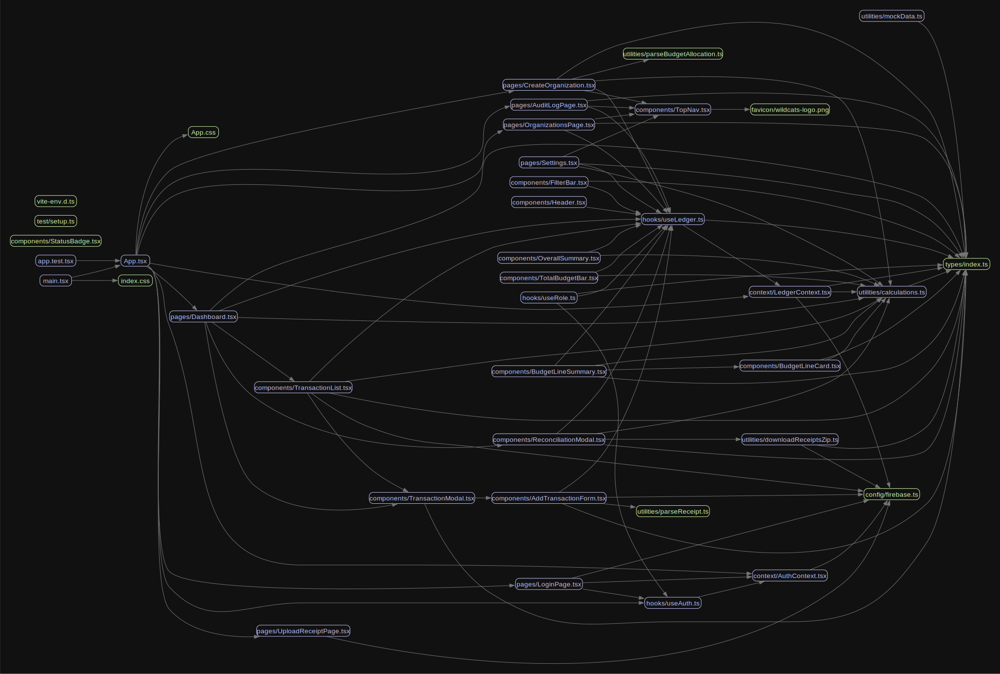

# Architecture & Code Quality Review

**Team:** Christopher Ridad, Valary Anguzuzu, Erich Oh, Stanley Du, Corey Zhang

**Date:** April 28, 2026

**Commit reviewed:** 7e21a98d2020fbda21d8afc91f956b8e900ebff1

## Architecture diagram

### Surprises & observations
- The app has more moving parts than expected, and our shared understanding of the full system is thinner than we thought
- Ownership of key files is more siloed than it felt during development

### Diagram vs. reality (top 3 mismatches from madge)
1. `LedgerContext.tsx` is far larger than expected (604 lines) and more central than our diagram suggested
2. `AddTransactionForm.tsx` (944 lines) was treated as a single component but is doing the work of several
3. `src/types/index.ts` acts as a god module that nearly every file depends on, which wasn't visible until we saw the graph

### Bus factor overlay
Annotated diagram: `docs/architecture-bus-factor.png`

- Pink files (concentrated ownership): 32
- Pink files that are also hotspots (large or frequently edited): `useRole.ts`, `TopNav.tsx`, `parseBudgetAllocation.ts`
- Pink files that are also architectural centers (many other files import them): `TopNav.tsx`

Biggest single-person dependency: If Corey is unavailable, we can't update the navigation bar that appears across the entire app.

## Top 5 findings

| # | Finding | File(s) | Severity | Bus factor | Why it matters |
|---|---------|---------|----------|------------|----------------|
| 1 | Key files are owned by single developers, making the codebase fragile | `TopNav.tsx`, `useRole.ts` | High | 1 (100% one author) | If that person is unavailable, critical parts of the app cannot be changed |
| 2 | `AddTransactionForm.tsx` is 944 lines and doing too much | `src/components/AddTransactionForm.tsx` | High | 2 | Hardest file to debug, most duplicated code found here |
| 3 | `LedgerContext.tsx` is 604 lines with 51% owned by one person | `src/context/LedgerContext.tsx` | High | 1 (51% one author) | Core data layer is fragile since it's the most edited file in the codebase |
| 4 | `src/types/index.ts` is a god module everything depends on | `src/types/index.ts` | Medium | 2 | Any change to shared types risks breaking the entire app |
| 5 | Duplicated logic across modal components | `ReconciliationModal.tsx`, `TransactionModal.tsx` | Medium | 2 | Should be extracted into a shared hook or component |

## Tool output summary
- jscpd: 12 duplicated blocks found, largest 17 lines
- madge: 0 circular dependencies, biggest module `src/types/index.ts`
- Largest files: `AddTransactionForm.tsx` (944 lines), `LedgerContext.tsx` (604 lines), `TransactionModal.tsx` (59 lines)
- Unused exports: 10 (`BudgetLineSummary`, `FilterBar`, `Header`, `OverallSummary`, `TotalBudgetBar`, `firebase.ts default`, `useRole`, `Settings`, `mockTransactions`, `LedgerContextValue`)

## What we'd fix first, and why
Break `AddTransactionForm.tsx` into smaller, reusable components. At 944 lines, it's the largest file in the codebase and contains the most duplicated logic. Splitting it up would reduce bus factor risk and make the codebase easier for the whole team to work in.

## Lessons for the next project
1. Next time, we will sketch an architecture diagram before writing any code and update it as the project evolves.
2. Next time, we will ensure swarm sessions involve the full team so everyone understands every part of the codebase.
3. Next time, we will write tests for shared files so bugs are caught early.
